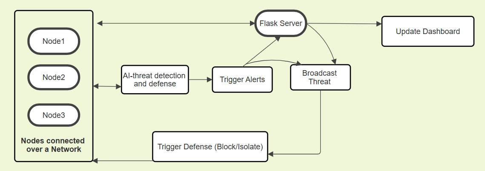

# Cyber Sentinels – Autonomous Digital Immune Network 

## Overview

Autonomous Digital Immune Network is an AI-powered collaborative cybersecurity framework designed to detect, share, and mitigate cyber threats across multiple network nodes in real time.

Unlike traditional security systems that operate independently, ADIN enables connected systems to communicate detected threats instantly, allowing all nodes in the network to defend themselves before attacks spread.

---

## Problem Statement

Modern cyber attacks propagate rapidly because most systems defend themselves in isolation.

### Challenges in Existing Systems

- Lack of real-time threat intelligence sharing
- Slow response to unknown or zero-day attacks
- Isolated defense mechanisms
- Delayed mitigation after compromise
- High dependency on manual intervention

Traditional antivirus and intrusion detection systems often react only after an attack has already occurred.

---

## Solution

Cyber Sentinels introduces a distributed autonomous defense architecture where:

1. A node detects suspicious behavior using AI-based anomaly detection
2. The threat is classified and assigned a risk score
3. Threat intelligence is broadcast across the network
4. Connected nodes automatically update defenses
5. Malicious IPs/processes are blocked using firewall automation

This enables:

- Faster response time
- Network-wide collaborative defense
- Reduced attack propagation
- Autonomous mitigation without human intervention

---

## System Architecture

## Contributors

Deeptha Bandi

Meghana Gandham

Durga Nagasri Ravoori

Tejaswi Bellapu

